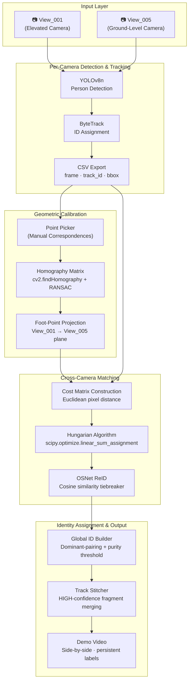
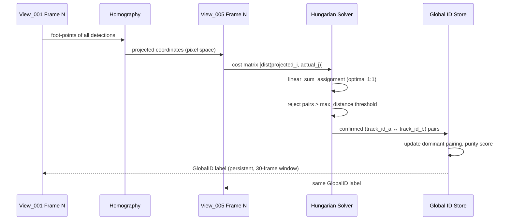
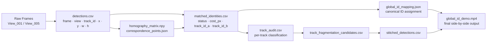

# Multi-Camera Person Re-Identification System

<div align="center">


**Given two cameras observing the same environment from different viewpoints, identify and assign consistent identities to the same person across all views.**

[Overview](#overview) • [Pipeline](#pipeline) • [Results](#results) • [Investigation](#investigation) • [Installation](#installation) • [Usage](#usage) • [Future Work](#future-work)

</div>

---

## Overview

This project implements a **geometry-first, multi-camera person re-identification pipeline** evaluated on the [PETS2009](http://www.cvg.reading.ac.uk/PETS2009/) benchmark dataset. The core challenge — assigning a consistent Global ID to the same person appearing in two cameras with a significant viewpoint difference (elevated CCTV angle vs. ground-level view) — is addressed through a deliberate engineering methodology: **measure before you build, and know when to stop.**

The project is structured not as a single pipeline, but as an **investigation**. Six interventions were designed, implemented, and empirically evaluated. Each produced a quantified result that either confirmed or refuted the working hypothesis, driving the next decision. The architecture reflects what the data actually supports, not what the literature suggests should work.

> **The key finding:** for this specific camera pair, geometry-first matching via homography projection and Hungarian assignment is the dominant signal. OSNet appearance embeddings show only moderate discriminative power (positive/negative overlap ≈ 0.50) under the elevated-vs-ground viewpoint gap — a result that justified *not* building appearance fusion, rather than blindly adding a component because the architecture called for it.

---

## Features

- **End-to-end multi-camera tracking pipeline**: detection → tracking → cross-view matching → identity assignment → demo video
- **Geometry-first matching**: manual homography calibration, foot-point projection, Hungarian optimal assignment
- **Diagnostic infrastructure**: audit tooling, fragmentation analysis, ReID separation analysis, visual review tooling — all designed to drive decisions rather than decorate the pipeline
- **Evidence-based intervention history**: six tested improvements with before/after metrics, including two correctly-identified negative results (BoT-SORT swap, ReID fusion)
- **Global ID persistence**: domain-specific temporal smoothing accounting for low-coverage tracks and ByteTrack fragmentation

---

## Project Architecture

### System Overview



### Cross-Camera Matching Detail



### Data Flow



---

## Repository Structure

```
ReID/
│
├── data/
│   ├── View_001/                     # PETS2009 elevated camera frames
│   ├── View_005/                     # PETS2009 ground-level camera frames
│   ├── cam1.mp4                      # Video generated from View_001 frames
│   └── cam2.mp4                      # Video generated from View_005 frames
│
├── calibration/
│   ├── point_picker.py               # Interactive GUI for manual correspondence selection
│   ├── homography.py                 # RANSAC homography computation, projection utilities
│   ├── correspondence_points.json    # Saved ground-plane correspondence pairs
│   └── homography_matrix.npy         # Computed 3×3 homography matrix
│
├── matching/
│   ├── hungarian_match.py            # Geometry-only cross-camera matching
│   ├── reid_embedder.py              # OSNet wrapper: crop → embedding → cosine similarity
│   ├── validate_reid_signal.py       # Matched vs. rejected pair similarity comparison
│   ├── reid_separation_analysis.py   # Full positive/hard-negative/easy-negative distribution analysis
│   ├── analyze_rejected_matches.py   # Visual diagnosis of failed geometry matches
│   ├── batch_check_projection.py     # Batch homography projection validation
│   ├── check_projection.py           # Single-frame projection sanity check
│   ├── audit_all_tracks.py           # Bidirectional per-track classification (both views)
│   ├── diagnose_pairing_stability.py # Track pairing purity and coverage analysis
│   ├── track_fragmentation_analyzer.py # OSNet-based within-camera fragment detection
│   ├── fragmentation_visualizer.py   # Side-by-side review images for fragment candidates
│   ├── track_stitcher.py             # HIGH-confidence fragment chain merging
│   ├── build_global_ids.py           # Dominant-pairing GlobalID assignment
│   └── generate_global_id_demo.py    # Final annotated side-by-side demo video
│
├── outputs/
│   ├── batch_check/                  # Projection validation images
│   ├── rejected_analysis/            # Failed-match diagnostic images
│   ├── fragmentation_review/         # Fragment candidate review images + contact sheet
│   ├── reid_separation/              # Similarity distributions, histogram, report
│   ├── track_audit.csv               # Per-track classification results
│   ├── matched_identities.csv        # Full frame-by-frame matching output
│   ├── global_id_mapping.json        # Canonical ID → track mapping
│   ├── stitch_mapping.json           # Track chain merge records
│   └── global_id_demo.mp4            # Final demo video
│
├── images_to_video.py                # Frame folder → MP4 conversion (sorted, verified)
├── tracking.py                       # YOLOv8 + ByteTrack per-camera tracking
├── export_tracks_to_csv.py           # Tracking output → detections.csv export
├── verify_frame_alignment.py         # Frame count validation (video vs. source folder)
├── requirements.txt
└── README.md
```

---

## Pipeline

### Stage 1 — Detection & Tracking (Per Camera)

Each camera view is processed independently using **YOLOv8n** for person detection with class filtering (`classes=[0]`) and **ByteTrack** for within-camera ID persistence. Results are exported to a unified CSV format:

```
frame, view, track_id, x, y, w, h
```

Bounding box coordinates use top-left `(x, y)` with `(w, h)` dimensions, consistent throughout the pipeline. This format was deliberately standardised early: every downstream script — homography, matching, ReID, evaluation — reads this single schema.

### Stage 2 — Geometric Calibration

A planar homography is computed between View_001 and View_005 using manually-selected ground-plane correspondences (painted calibration lines and landmark intersections visible in both views). Key decisions:

- **RANSAC** (`cv2.findHomography`) for robustness to mis-clicked points
- **Foot-point projection**: bottom-centre of each bounding box `(x + w/2, y + h)` is used as the ground-plane anchor, consistent with standard ReID practice
- **5/8 RANSAC inliers**, mean reprojection error ≈ 25px, max ≈ 130px

### Stage 3 — Cross-Camera Matching

For each frame, all person detections in View_001 are projected into View_005's coordinate space using the homography. A cost matrix of Euclidean distances between projected and actual foot-points is constructed and solved with **scipy's `linear_sum_assignment`** (Hungarian algorithm). Pairs exceeding `max_distance = 150px` are rejected rather than force-assigned.

```python
cost_matrix[i, j] = euclidean(projected_foot_i, actual_foot_j)
row_idx, col_idx = linear_sum_assignment(cost_matrix)
# reject assignments where cost > max_distance
```

### Stage 4 — Global Identity Assignment

Track pairings are aggregated across frames. Each `track_id_a` → `track_id_b` mapping is assigned a **purity score** (fraction of matched frames agreeing on the dominant partner). Tracks passing both a purity threshold (≥70%) and a coverage threshold (≥10 matched frames) are assigned a canonical `GlobalID` (P1, P2, ...). GlobalIDs are displayed with temporal persistence to handle frames where geometry doesn't re-confirm a match.

---

## Investigation & Results

This project was run as a structured engineering investigation. Six interventions were evaluated. The table below summarises the outcome of each.

| # | Intervention | Hypothesis | Result | STABLE_MATCHED |
|---|---|---|---|---|
| 0 | Baseline: YOLOv8 + ByteTrack + Homography + Hungarian | — | Working end-to-end pipeline | 20 |
| 1 | BoT-SORT replacing ByteTrack | Tracker fragmentation is the bottleneck | ❌ Minimal change | 14 |
| 2 | Track fragmentation analysis (OSNet within-camera) | Fragmented tracks are recoverable by appearance | ✅ 6 HIGH-confidence chains found, visually verified | — |
| 3 | Track stitching (HIGH-confidence chains only) | Merging fragments improves cross-camera matching | ❌ Marginal improvement | ~20 |
| 4 | OSNet ReID separation analysis | OSNet can disambiguate hard negatives from true matches | ⚠️ Moderate: overlap = 0.50, gap = 0.04 | — |
| 5 | ReID fusion into Hungarian cost matrix | Appearance can recover LOW_CONFIDENCE_MATCH cases | ⏭️ Not built — empirical evidence did not justify it | — |

### Key Quantitative Findings

**Homography calibration:**
| Metric | Value |
|---|---|
| Correspondence points | 8 (5 RANSAC inliers) |
| Mean reprojection error | 25 px |
| Max reprojection error | 130 px |

**Matching performance:**
| Status | Count |
|---|---|
| STABLE_MATCHED | 20 tracks |
| LOW_CONFIDENCE_MATCH | 18 tracks |
| FRAGMENTED | 14 tracks |
| FAILED_COVERAGE | 11 tracks |
| NEVER_MATCHED | 9 tracks |

**ReID separation analysis (positive vs. hard negative):**
| Metric | Value |
|---|---|
| Positive mean similarity | 0.7285 |
| Hard negative mean similarity | 0.6864 |
| Distribution overlap | 0.50 |
| Mean gap | 0.042 |

> The 0.50 overlap on hard negatives (geometrically plausible but incorrect pairs) directly informed the decision not to build ReID fusion — the appearance signal was insufficiently discriminative to justify the implementation cost and the risk of incorrect overrides to already-correct geometric assignments.

### Track Classification Breakdown

```
STABLE_MATCHED        ████████████████████░░░░░░░░░░░  20
LOW_CONFIDENCE_MATCH  ██████████████████░░░░░░░░░░░░░  18
FRAGMENTED            ██████████████░░░░░░░░░░░░░░░░░  14
FAILED_COVERAGE       ███████████░░░░░░░░░░░░░░░░░░░░  11
NEVER_MATCHED         █████████░░░░░░░░░░░░░░░░░░░░░░   9
FAILED_PURITY         ███░░░░░░░░░░░░░░░░░░░░░░░░░░░░   3
```

---

## Challenges

### Viewpoint Gap
View_001 (elevated, wide-angle) and View_005 (ground-level, narrow) produce fundamentally different visual signatures for the same person. OSNet, trained on near-horizontal CCTV pairs (Market1501, DukeMTMC), lacks the viewpoint invariance this scenario demands. This is a dataset-model mismatch that cannot be resolved by threshold tuning — it requires either a different model (TransReID with viewpoint augmentation) or camera-pair-specific fine-tuning with labeled ground truth.

### Tracking Fragmentation
ByteTrack relies on motion continuity and IoU overlap for re-identification after occlusion. When a person is briefly occluded by a pole or another pedestrian, ByteTrack assigns a new track ID on reappearance. This creates artificial fragmentation — the person is correctly tracked within each contiguous segment but treated as a new identity globally. BoT-SORT (with appearance re-association) produced no measurable improvement on this dataset, likely because the viewpoint gap also degrades BoT-SORT's appearance signal at the moment of reacquisition.

### Homography Limitations
A planar homography assumes all matched points lie on a single flat ground plane. PETS2009's primary scene has a slight slope documented in the original dataset notes. This causes systematic projection error in depth-distant regions of the scene — projected points drift from their actual locations by more than the matcher's tolerance, producing rejected matches that are geometrically correct but numerically noisy.

### Frame-Independent Matching
Hungarian matching solves each frame independently with no memory of previous assignments. When two people are geometrically close, the cost matrix can have near-equal solutions, and small homography noise flips the optimal assignment frame-to-frame. This is the direct cause of LOW_CONFIDENCE_MATCH purity degradation and was the dominant unresolved bottleneck at project completion.

---

## Installation

```bash
# Clone the repository
git clone https://github.com/<your-username>/multi-camera-reid.git
cd multi-camera-reid

# Create and activate a virtual environment
python -m venv venv
source venv/bin/activate   # Windows: venv\Scripts\activate

# Install dependencies
pip install -r requirements.txt
```

### Requirements

```
ultralytics>=8.0.0        # YOLOv8 + ByteTrack/BoT-SORT
torch>=2.0.0
torchvision>=0.15.0
torchreid                 # OSNet embedder
opencv-python>=4.8.0
numpy>=1.24.0
scipy>=1.10.0
matplotlib>=3.7.0
```

### Dataset Setup

Download the PETS2009 dataset from the [official source](http://www.cvg.reading.ac.uk/PETS2009/) or [Kaggle mirror](https://www.kaggle.com/datasets/yeeandres/pets2009). Place frame sequences under:

```
data/
├── View_001/   # frame_0000.jpg ... frame_0794.jpg
└── View_005/   # frame_0000.jpg ... frame_0794.jpg
```

Then generate video files:

```bash
python images_to_video.py
python verify_frame_alignment.py --video data/cam1.mp4 --frames_dir data/View_001
```

---

## Usage

The pipeline is modular and designed to be run stage by stage, with diagnostic validation at each step before proceeding.

### 1. Track people in each camera

```bash
python tracking.py   # generates cam1.mp4 and cam2.mp4 tracking videos
python export_tracks_to_csv.py --video data/cam1.mp4 --view View_001 --out tracks_view001.csv
python export_tracks_to_csv.py --video data/cam2.mp4 --view View_005 --out tracks_view005.csv
cat tracks_view001.csv > detections.csv
tail -n +2 tracks_view005.csv >> detections.csv
```

### 2. Calibrate the homography

```bash
# Interactive point-picking GUI — select 8-12 ground-plane correspondences
python calibration/point_picker.py \
    --img1 data/View_001/frame_0150.jpg \
    --img2 data/View_005/frame_0150.jpg \
    --out calibration/correspondence_points.json

python calibration/homography.py compute \
    --points calibration/correspondence_points.json \
    --out calibration/homography_matrix.npy
```

### 3. Run cross-camera matching

```bash
python matching/hungarian_match.py \
    --detections detections.csv \
    --view_a View_001 --view_b View_005 \
    --homography calibration/homography_matrix.npy \
    --out outputs/matched_identities.csv \
    --max_distance 150
```

### 4. Audit and diagnose

```bash
python matching/audit_all_tracks.py \
    --detections detections.csv \
    --matched outputs/matched_identities.csv \
    --view_a View_001 --view_b View_005 \
    --out_csv outputs/track_audit.csv \
    --out_report outputs/summary_report.txt
```

### 5. Assign Global IDs and generate demo video

```bash
python matching/build_global_ids.py \
    --matched outputs/matched_identities.csv \
    --out outputs/global_id_mapping.json \
    --min_purity 70 --min_coverage 10

python matching/generate_global_id_demo.py \
    --detections detections.csv \
    --mapping outputs/global_id_mapping.json \
    --frames_dir_a data/View_001 --frames_dir_b data/View_005 \
    --view_a View_001 --view_b View_005 \
    --out outputs/global_id_demo.mp4 \
    --fps 7
```

### Running the ReID separation diagnostic

```bash
python matching/reid_separation_analysis.py \
    --matched outputs/matched_identities.csv \
    --detections detections.csv \
    --frames_dir_a data/View_001 --frames_dir_b data/View_005 \
    --view_a View_001 --view_b View_005 \
    --n_positive 40 --n_hard_negative 40 \
    --out_dir outputs/reid_separation
```

---

## Future Work

The following improvements are ordered by expected impact on cross-camera matching accuracy, based on the current failure analysis.

### High Priority

**Temporal consistency in Hungarian matching**
The largest unresolved failure mode is frame-independent matching flipping assignments when two people are geometrically close. Adding a temporal prior — a small cost bonus for repeating the previous frame's assignment — directly targets this without any new model or data dependency.

**Recalibration with more correspondence points**
The current 130px max reprojection error contributes directly to LOW_CONFIDENCE_MATCH cases. Re-running the calibration with 10-12 carefully-spread ground-plane correspondences (targeting <60px max error) is the single cheapest possible intervention with meaningful expected gain.

**TransReID as OSNet replacement**
TransReID's ViT backbone was explicitly trained with viewpoint augmentation, addressing the architectural mismatch between OSNet's training distribution and this project's elevated-vs-ground viewpoint gap. Before building fusion logic, running `reid_separation_analysis.py` with TransReID would empirically determine whether the overlap coefficient improves enough to justify the implementation cost.

### Medium Priority

**Adding View_003 as a third camera**
PETS2009 View_003 observes much of the same ground plane from a complementary angle. A third view increases corroborating evidence for each cross-camera association and allows majority-vote identity resolution when two of three views agree. Requires extending the matching pipeline from pairwise to multi-way association, but the geometric infrastructure (homography, foot-point projection) generalises directly.

**Temporal smoothing of Hungarian assignments (sliding window)**
Rather than solving each frame independently, aggregate cost matrices over a short window of frames (5-7) and solve on the smoothed cost. This amortises frame-to-frame noise without requiring a full trajectory-tracking layer.

### Production Considerations

**Automated homography via learned feature matching**
Manual correspondence selection does not scale beyond a handful of camera pairs. For deployments with many cameras, replacing manual point-picking with SuperPoint + SuperGlue (or LightGlue) learned feature matching, combined with RANSAC, would automate calibration. The severe viewpoint gap in this specific camera pair makes vanilla ORB/SIFT unreliable — learned features with viewpoint augmentation are necessary.

**Global world-coordinate system for N cameras**
Pairwise homography scales O(N²) in calibration effort. For large deployments, each camera should be independently calibrated to a shared world coordinate system (GPS or site-specific grid), and cross-camera matching should operate in world coordinates rather than image-pair coordinates. This is the standard architecture in production multi-camera surveillance systems and removes the pairwise bottleneck entirely.

**Real-time deployment**
The current pipeline is offline (reads from video files). Real-time deployment would require streaming detection/tracking at the edge (NVIDIA Jetson/DeepStream), a message broker (Kafka) decoupling per-camera inference from the central matching engine, and a vector DB (Milvus/FAISS) for embedding storage and similarity search at scale.

---

## Key Learnings

**Diagnostic infrastructure is not overhead — it is the project.**
The scripts that proved the most valuable were not the ones that built features, but the ones that measured whether features were worth building. The ReID separation analysis, the track audit, and the visual rejection inspector collectively saved significant engineering time by correctly identifying two interventions (BoT-SORT swap, ReID fusion) as not worth pursuing — before they were built.

**A clear negative result is a real result.**
The correct response to "OSNet overlap is 0.50 against hard negatives" is not to tune the threshold until it looks better — it is to document what was measured, explain what it means for the proposed architecture, and adjust the plan accordingly. This is what distinguishes an engineering investigation from iterative tinkering.

**The geometry-appearance priority ordering matters more than the models chosen.**
Geometry (homography projection + Hungarian) carried the vast majority of the matching accuracy achieved in this project. Appearance (OSNet) contributed marginally. On a camera pair with a smaller viewpoint gap, this ordering would likely remain correct — geometry provides the prior, appearance refines it. Choosing a "better" ReID model without first understanding whether appearance can outperform geometry on the specific camera configuration is a common mistake this project explicitly avoided.

**Temporal consistency is a presentation problem and a matching problem simultaneously.**
Global IDs flickering in the output video and Global IDs switching assignments in the underlying matcher are two different bugs with different fixes. Conflating them leads to fixing the wrong thing.

---

## References

| Resource | Link |
|---|---|
| PETS2009 Dataset | [cvg.reading.ac.uk/PETS2009](http://www.cvg.reading.ac.uk/PETS2009/) |
| YOLOv8 (Ultralytics) | [github.com/ultralytics/ultralytics](https://github.com/ultralytics/ultralytics) |
| ByteTrack | [github.com/ifzhang/ByteTrack](https://github.com/ifzhang/ByteTrack) |
| BoT-SORT | [github.com/NirAharon/BoT-SORT](https://github.com/NirAharon/BoT-SORT) |
| OSNet (torchreid) | [github.com/KaiyangZhou/deep-person-reid](https://github.com/KaiyangZhou/deep-person-reid) |
| TransReID | [github.com/damo-cv/TransReID](https://github.com/damo-cv/TransReID) |
| FastReID | [github.com/JDAI-CV/fast-reid](https://github.com/JDAI-CV/fast-reid) |
| MOT Challenge Benchmark | [motchallenge.net](https://motchallenge.net/) |
| AI City Challenge (MTMC) | [aicitychallenge.org](https://www.aicitychallenge.org/) |
| Hungarian Algorithm (scipy) | [docs.scipy.org](https://docs.scipy.org/doc/scipy/reference/generated/scipy.optimize.linear_sum_assignment.html) |

---

## Acknowledgements

Built as part of a Data Science internship POC at NeoSoft. Dataset provided by the Computer Vision Group, University of Reading (PETS2009). Team collaboration with Jay (ReID module validation) and Koustabh and Sruthik (parallel POC workstreams).

---

## License

This project is licensed under the MIT License. See [LICENSE](LICENSE) for details.

---

<div align="center">

*This README documents an engineering investigation, not just a pipeline.*
*The diagnostic scripts are as much a part of the contribution as the matching system itself.*

</div>
